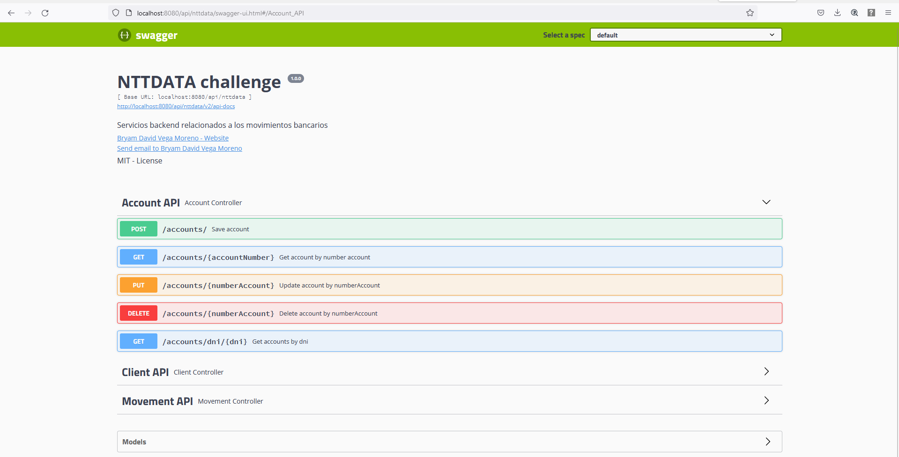

# NTTDATA CHALLENGE
 > **autor:** Bryam David Vega Moreno
 
El desarrollo de este reto consta de un API BACKEND de movimientos bancarios. El desarrollo del mismo
fue mediante Spring boot y un conjunto de tecnologias que facilitan y mejoran el desarrollo del mismo

## Tecnologias y herramientas utilizadas para el desarrollo del reto

* Lenguaje de programacion : `Java`
* Framework: `Spring Framework`
* Librerias utilizadas:
  * `MapStruct`
  * `Swagger`
  * `Spring validation`
  * `Junit`
  * `Bean Utils`
  * `Lombook`
* Base de datos: `PostgreSQL`
* Despliegue de la aplicacion:
  * `Dockers`
* Gestor de empaquetado: `Gradle`

## Patrones de disenio utilizados

* Patron Builder
* Patron Adapter
* Patron Singleton (Scope por defecto de spring)
* Patron repository

## Endpoints realizados

Los endpoints realizados para este proyecto empiezan mediante el contexto `/api/nttdata`, por tanto tomando 
esto en consideracion los endpoints que se crearon son los siguientes:

* **Cliente API**
  * `GetClients`
  * `GetClientByDni`
  * `SaveClient`
  * `UpdateClient`
  * `DeleteClientById`
* **Cuentas API**
  * `GetAccountByNumberAccount`
  * `GetAccountByClientDni`
  * `UpdateAccountByNumberAccount`
  * `CreateAccount`
  * `DeleteAccountByNumberAccount`
* **Movimientos API**
  * `GetMovementsByClientDni`
  * `GetMovementsByAccountNumber`
  * `GetMovementsByFilter`
  * `CreateMovement`

Estos endpoints lo podemos encontrar mediante la documentacion de swagger, el cual se puede ingresar
mediante el link `http://localhost:8080/api/nttdata/swagger-ui.html`, obteniendo el siguiente resultado



De la misma forma, se encuentra en un archivo `.json` el conjunto de endpoints listos para
correr en postman, el cual se encuentra en la siguiente ruta `postman/NTTDATA.postman_collection.json`.

## Test Unitarios

Para realizar los test unitarios se utilizo junit y mockito. Para este caso se crearon 4 test que permiten
realizar pruebas a nivel de controller y service para los clientes y cuentas. Recordar que cuando se ejecuten los test
se debe modificar la anotacion `spring.datasource.url` el cual en la conexion a base se debe apuntar al localhost, ya que
actualmente el mismo esta funcionando para que al dockerizar tome el docker de base de datos como red bridge.

## Como desplegar la aplicacion

1. Clonar el proyecto desde `https://github.com/bvegaM/nttdata-challenge.git`
2. Tener instalado gradle para poder empaquetar el proyecto mediante el comando `gradle build --refresh-dependencies -x test`
3. Tener listo docker y en la base del proyecto correr el comando `docker build -t nttdata-challenge .`
4. Una vez realizado el mismo, ingresar a la carpeta `docker` y correr el archivo `docker-compose.yml` mediante el comando `docker-compose up`
5. Con ello se levantara la base de datos con las tablas y datos de prueba y a su vez se levantara la aplicacion de spring.

## Datos de prueba

* Crear un cliente
```json
{
  "cedula": "0101437812",
  "contrasenia": "luz.123",
  "direccion": "colombia y paraguay",
  "edad": 60,
  "estado": true,
  "genero": "F",
  "nombre": "Luz Cordero",
  "telefono": "0985164142",
  "usuario": "lcordero"
}
```
* Crear una cuenta
```json
{
  "clienteCedula": "0101437812",
  "estado": true,
  "numeroCuenta": "000090",
  "saldo": 1500,
  "tipoCuenta": "AHORRO"
}
```
* Crear un movimiento
```json
{
  "numeroCuenta": "000090",
  "tipoMovimiento": "DEPOSITO",
  "valor": 1350
}
```

